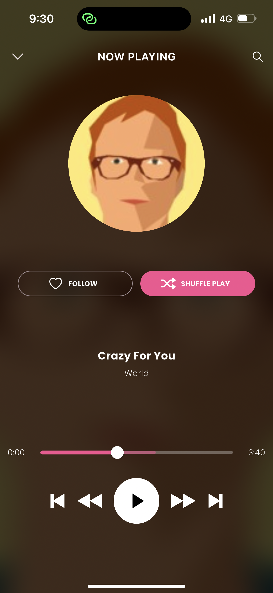
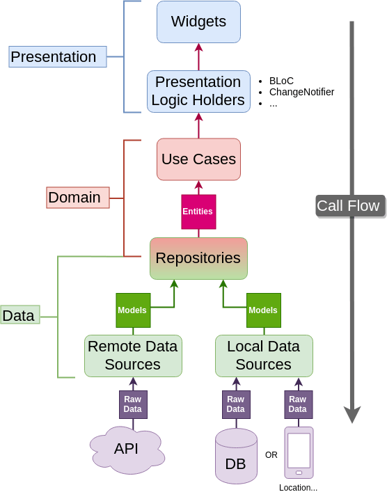

# ArabiaMusic App

This repository houses the Flutter codebase for the ArabiaMusic mobile app, designed to run on both Android and iOS platforms. 🚀

## Screenshots
 

## Backend
The backend for this app is implemented using RESTful API services and leverages Faker JS to generate fake music list data, including song names, genres, and album images. The application's backend is hosted on the MockAPI platform, providing a simulated environment for interactions with a real backend during development and testing phases. For in-depth information on the API endpoints and responses, please consult the [MockAPI platform](https://mockapi.io/clone/657742f7197926adf62dd317).

## Design
The app's design has been crafted using Adobe XD. You can view the design specifications and visual elements by following this [Adobe XD link](https://xd.adobe.com/view/cd7927c0-96d7-4af3-98d5-5fca380b9ea1-982a/specs/).

## Frontend
The frontend of the ArabiaMusic app is developed using Flutter version 3.16.3. We have adopted the Bloc state management pattern to efficiently manage the application's state. The separation of concerns (SoC) architecture is employed, ensuring a clear distinction between the app's logic and presentation layers.

### State Management
The Bloc pattern provides a structured and predictable way to manage the state of the application. It separates the presentation layer from the business logic, enhancing maintainability and scalability.

### Architecture
The app follows the Separation of Concerns (SoC) principle, where the logic and presentation layers are distinctly separated. This promotes code organization, making it easier to understand, test, and maintain.

 

Feel free to explore the codebase of the ArabiaMusic app! If you have any questions or feedback, don't hesitate to open an issue or reach out to us.
